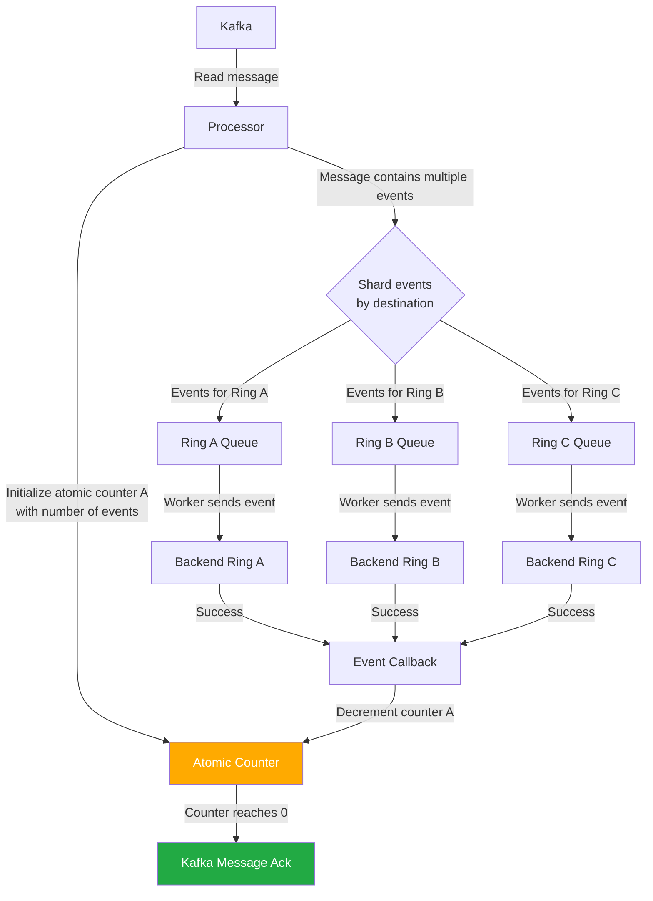
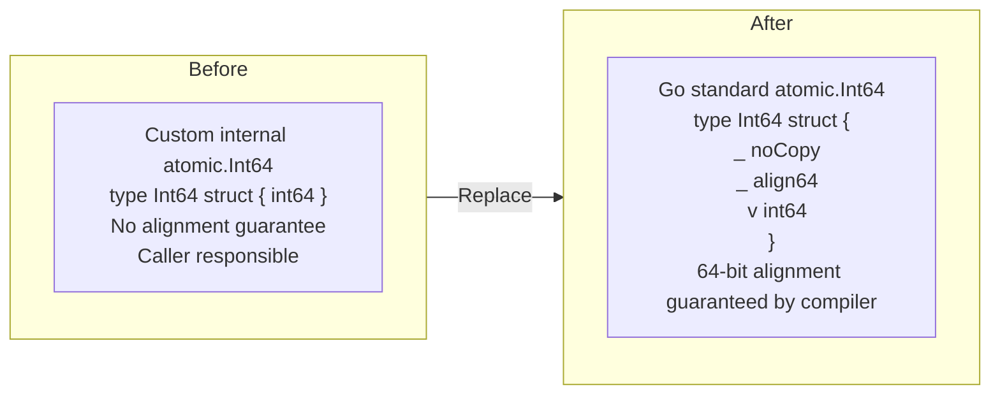

# Debugging Missing Kafka Acks: A Go Atomic Alignment Bug Hidden in Plain Sight

---

## The Problem

For a couple of years, I had intermittent missing ack occurrences on Kafka messages in one of my ingestion pipelines. The problem was elusive — it didn't affect all traffic consistently, and for a while it seemed to go away on its own. Then it came back, hitting my logs pipeline multiple times per day.

What made it particularly frustrating was the evidence I collected when it happened:

- All events were sent successfully to the backend
- All callbacks for the events were called
- No queues were blocked — new events were being added and processed normally
- And yet: the ack routine for certain Kafka messages was never called

The operational burden was real: missing acks meant stuck ingestion partitions, and stuck partitions meant someone had to wake up at night and manually kill the affected pods to recover the pipeline. This was happening daily. Everything looked fine in the code. And nothing worked.

---

## The Ingestion Pipeline

To understand the bug, it helps to understand how my ingestion pipeline processes Kafka messages.



The key detail is the atomic counter. When the processor reads a Kafka message containing N events, it initializes an atomic counter to N. Each event gets a callback that decrements the counter when the event is successfully delivered. When the counter reaches zero — meaning all events in the message have been delivered — the Kafka message is acknowledged.

Simple and elegant. And subtly broken.

---

## The Investigation

I started by instrumenting the code with additional monitoring and logging to capture exactly what was happening when a missing ack occurred. The observations were consistent:

- All events were sent successfully to the backend
- All callbacks for the events were called
- No ring queue was blocked — new events were being added and processed normally
- The ack routine for some Kafka messages was simply never called

This told us something important: the problem wasn't in the event delivery path or the backend. It was in my own ingestion code. Specifically, in the mechanism that aggregated the individual event callbacks into a final message ack.

I systematically eliminated the plausible causes:

- Network issues: ruled out — events were delivering successfully
- Backend failures: ruled out — callbacks were firing
- Queue blockage: ruled out — queues were processing normally
- Logic errors in the callback: ruled out — the code was straightforward

With every other explanation eliminated, one suspect remained: the atomic counter itself. Concurrency is never easy, and an atomic operation behaving incorrectly under specific conditions would produce exactly the symptoms I was seeing — all the individual pieces working, but the composed result silently failing.

I looked closely at the custom-built internal atomic library my code was using, and compared its implementation against Go's newly released `atomic.Int64` type from Go 1.19. That comparison led us to the warning comment in Go's `sync/atomic` documentation for `AddInt64`:

```go
// AddInt64 atomically adds delta to *addr and returns the new value.
// Consider using the more ergonomic and less error-prone [Int64.Add] instead
// (particularly if you target 32-bit platforms; see the bugs section).
func AddInt64(addr *int64, delta int64) (new int64)
```

That warning — "see the bugs section" — was the signal. The bugs section stated:

> On ARM, 386, and 32-bit MIPS, it is the caller's responsibility to arrange for 64-bit alignment of 64-bit words accessed atomically via the primitive atomic functions.

If Go's own standard library was warning about alignment being the caller's responsibility, what guarantees was my custom library actually providing?

---

## The Root Cause

I inspected the custom library's `Int64` type. It was defined as:

```go
type Int64 struct {
    int64
}
```

No alignment enforcement. No `noCopy`. No `align64`. Alignment entirely the caller's responsibility — with no mechanism to enforce it.

Compare this to Go's native `atomic.Int64`, introduced in Go 1.19:

```go
type Int64 struct {
    _ noCopy
    _ align64
    v int64
}
```

Where `align64` is defined as:

```go
// align64 may be added to structs that must be 64-bit aligned.
// This struct is recognized by a special case in the compiler
// and will not work if copied to any other package.
type align64 struct{}
```

The Go standard library's `align64` is recognized by the compiler as a directive to enforce 64-bit memory alignment on the struct. The custom library had no equivalent. In certain struct layouts and memory configurations, the custom library's `Int64` could end up unaligned.

An unaligned 64-bit atomic operation is not guaranteed to be atomic. What looks like a single atomic decrement can behave incorrectly, leading to the counter getting stuck above zero — and the Kafka ack never firing.

---

## The Fix

I replaced the custom internal `Int64` with Go's native `atomic.Int64`. The change was almost mechanical — a straightforward substitution with alignment now guaranteed by the compiler rather than assumed by convention.



After deploying the change: no missing acks for several days, in a pipeline that had been requiring nightly manual intervention to kill stuck pods. The daily on-call pages stopped.

---

## Why This Is Easy to Miss

The bug has a few properties that make it particularly difficult to catch:

**It's non-deterministic.** Memory alignment issues depend on how structs are laid out at runtime. The same code might behave correctly in most configurations and break in specific ones. My bug affected logs traffic multiple times daily but hadn't been reproducible in trace traffic for over a year.

**All the visible signals look correct.** Every callback fires. Every event delivers. The only thing that fails is the counter reaching zero — and that failure is invisible until you're specifically watching for it.

**The root cause is in infrastructure code, not business logic.** You can audit ymy own application logic carefully and find nothing wrong, because the problem is in the atomic primitive being used underneath.

**The fix looks too simple.** Replacing one atomic type with another doesn't feel like it should fix a multi-year intermittent bug. It's easy to dismiss as coincidence.

---

## Lessons Learned

**1. Warning comments in standard library documentation are worth reading carefully.**

The Go standard library explicitly warned that `AddInt64` places alignment responsibility on the caller. That warning, read carefully during an unrelated investigation, was the signal that broke the case open. Documentation warnings exist for a reason — they often point at a class of bugs that has already hurt someone.

**2. When the standard library warns about a requirement, audit whether your dependencies satisfy it.**

The warning in Go's `sync/atomic` documentation led directly to inspecting the custom library. If the standard library itself says "be careful about alignment," any library wrapping or reimplementing atomic operations should be held to the same standard.

**3. Prefer Go's newer atomic types over custom implementations.**

Go's `atomic.Int64`, introduced in Go 1.19, handles 64-bit alignment automatically through the `align64` compiler hint. Custom atomic implementations that predate this — or that simply wrap the primitive functions — may not provide the same guarantees. When auditing existing code, check whether any custom atomic types enforce alignment explicitly.

**4. Non-deterministic bugs often have deterministic root causes.**

The intermittent nature of the missing acks felt like a race condition or a timing issue. It was actually a structural issue — a specific memory layout that violated an alignment requirement — that happened to manifest non-deterministically based on runtime conditions.

**5. When callbacks all fire but the composed result doesn't, look at the composition mechanism.**

In my case, the individual pieces (event delivery, callback invocation) were all working correctly. The failure was in the mechanism that combined them — the atomic counter. Narrowing the investigation to the aggregation layer rather than the individual operations was the key insight.

---

## Conclusion

A multi-year intermittent bug. Nightly manual interventions to kill stuck pods. All the visible signals pointing away from the real cause. The breakthrough coming not from a clever experiment but from reading a warning comment in the standard library documentation.

If you're seeing Kafka messages that never get acknowledged despite all their constituent work completing successfully, and you're using an atomic counter to track completion — check how that counter is defined. Specifically, check whether it enforces 64-bit alignment explicitly, or whether it assumes the caller will handle it.

Go's `atomic.Int64` from Go 1.19 onwards handles this correctly. If you're using a custom atomic type or wrapping primitive `sync/atomic` functions, it's worth asking: what alignment guarantees does this actually provide?

The answer might already be in the documentation you haven't fully read yet.
