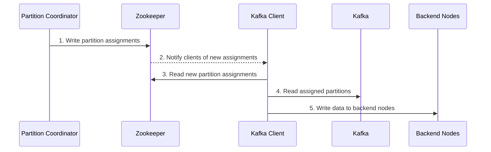
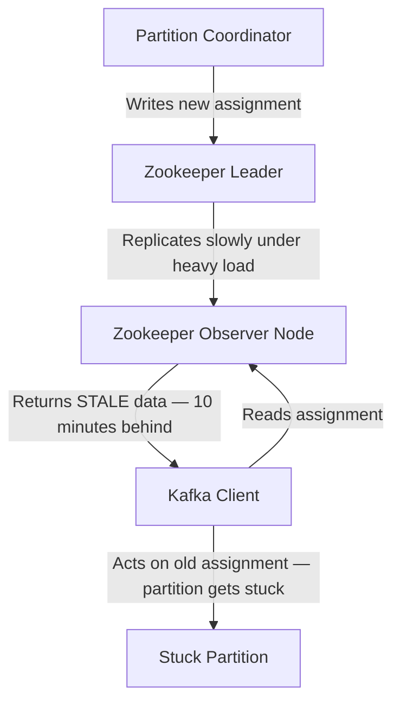
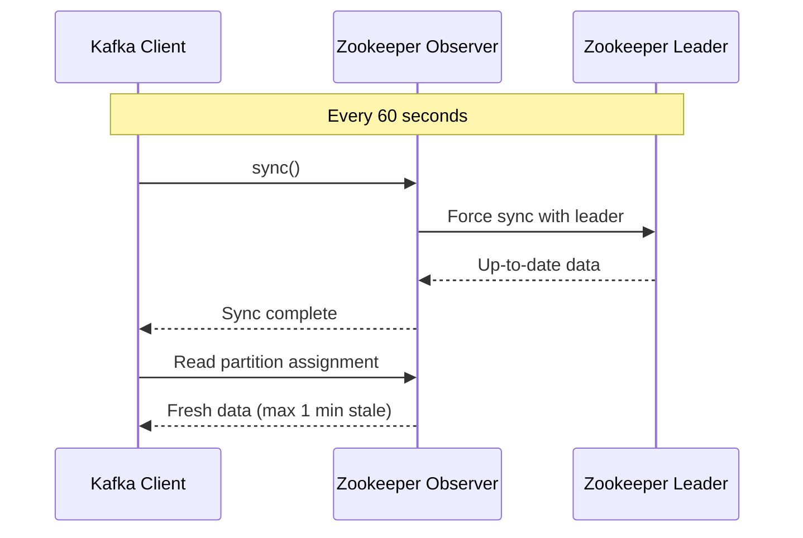

# Debugging Stuck Kafka Partitions: How a Zookeeper Stale Read Was Waking Us Up at Night

---

## The Problem

I run a live search system that depends on real-time data ingestion. The keyword is *live* — users expect results that reflect what's happening right now, not minutes ago.

But every so often, something would go wrong. A handful of Kafka partitions would get stuck. Ingestion would stall. The lag would grow. And someone's phone would buzz at 2am.

The incidents shared a few characteristics:

- Only certain Kafka partitions were affected, not all of them
- The stuck partitions would sit there for minutes, failing to ingest traffic
- Recovering required a long, manual intervention process
- It happened almost exclusively on clusters handling heavy traffic

The daily recurrence was bad enough on its own. But the real pressure came from what it meant for my SLO: ingestion lags were routinely breaching my service level objectives, with maximum daily lags running into hours without manual intervention. Every time it happened, I'd stumble through the same painful recovery. I knew something was broken. I just didn't know what.

---

## The Architecture

To understand the bug, it helps to understand how partition assignments work in my system.

I have a component called the **Partition Coordinator** that manages which backend nodes are responsible for which Kafka partitions. Here's the normal happy path:

Simple enough on paper. The Partition Coordinator decides. Zookeeper delivers. Clients act.

The problem was hiding in step 2.

---

## The Wrong Hypothesis

When partitions got stuck, the first thing I checked was whether assignment messages were being delivered. And what I found, consistently, was that there were *no assignment messages* for the stuck partitions.

That pointed us toward network problems, system failures, something fundamentally broken in the delivery path. I chased that hypothesis for a long time. I tried fixes. They didn't work. The incidents kept happening.

Then one night, I got lucky in the worst way. The incident ran long enough that I captured something I'd never seen before: **the assignment messages arrived. They were just 10 minutes late.**

That changed everything.

Missing messages and late messages look identical at first glance — in both cases, the client isn't acting on an assignment. But the causes are completely different. I'd been solving the wrong problem.

---

## What Late Assignments Actually Mean

If the Partition Coordinator is writing assignments to Zookeeper correctly, and the messages are arriving — just late — then something in the delivery path is introducing a significant delay.

Writing to Zookeeper fast enough to cause a 10-minute lag seemed unlikely. That left one other possibility: **clients were reading stale data from Zookeeper.**

In a distributed system with asynchronous replication, it's entirely possible for a read to return data that doesn't yet reflect the latest write. I searched for "Zookeeper stale read" and found my answer immediately.

The first result was Zookeeper's own internal documentation, which states clearly: **read operations in Zookeeper are not quorum operations.** A client reading from a Zookeeper observer node may receive data that hasn't yet been synchronized from the leader.

Under light load, the observer nodes stay largely in sync and this rarely matters. Under heavy traffic, the synchronization lag can grow — and in my case, it was growing to 10 minutes.

This explained everything. The problem only appeared on high-traffic clusters because that's where the observer nodes fell furthest behind. The partitions weren't missing their assignments. They were reading old ones.

---

## The Mitigation

A complete architectural fix — moving away from Zookeeper for time-critical partition assignment delivery — would take time. In the meantime, I needed to stop the bleeding.

My mitigation: **send a sync operation to Zookeeper every one minute.**

This forces the observer node to synchronize with the leader before responding, ensuring that assignment data is never more than a minute stale. The Zookeeper documentation notes that sync is not currently a quorum operation either, so it doesn't provide strict guarantees — but in practice, it was sufficient.

The results were immediate: maximum daily ingestion lag dropped from hours of unresolved stale reads down to around 30 seconds, and I stopped breaching my SLO. The 2am pages stopped.

It's a pragmatic fix rather than a principled one. But it worked, and it gave us time to plan a better long-term solution.

---

## Lessons Learned

**1. Late is not the same as missing.**

This sounds obvious in retrospect, but it's easy to treat absence of action as absence of signal. The distinction between "message not delivered" and "message delivered late" pointed us toward a completely different class of problem. Catching the right signal is everything in debugging.

**2. Know the consistency guarantees of your infrastructure components.**

I used Zookeeper to deliver time-critical partition assignment information without fully understanding its read semantics. Zookeeper reads are not linearizable by default — they can return stale data, and under load, that staleness can become significant. If ymy system depends on timely delivery of information through a shared infrastructure component, you need to understand and test what "timely" actually means under realistic load.

**3. Stress test shared infrastructure.**

The bug only manifested under heavy traffic. A thorough stress test of Zookeeper's synchronization behavior under load would have surfaced this earlier. Common infrastructure that multiple systems depend on deserves especially careful testing at scale.

**4. Assign clear ownership.**

When something breaks at the intersection of multiple systems, it's easy for each team to assume another team owns the problem. Clear ownership of shared components like Zookeeper makes debugging faster and prevents issues from falling through the cracks.

---

## Conclusion

A daily SLO breach hiding inside what looked like a missing message. A Zookeeper consistency property that most engineers don't think about until it bites them. A mitigation that required one line of configuration and brought maximum daily lag from hours down to 30 seconds.

The fix was simple. Finding it took months.

If your Kafka consumers are mysteriously stuck on high-traffic clusters, and you've already ruled out the obvious causes — check whether ymy partition assignment delivery path involves Zookeeper reads. And if it does, check whether those reads might be returning stale data.

The answer might already be in Zookeeper's own documentation.
